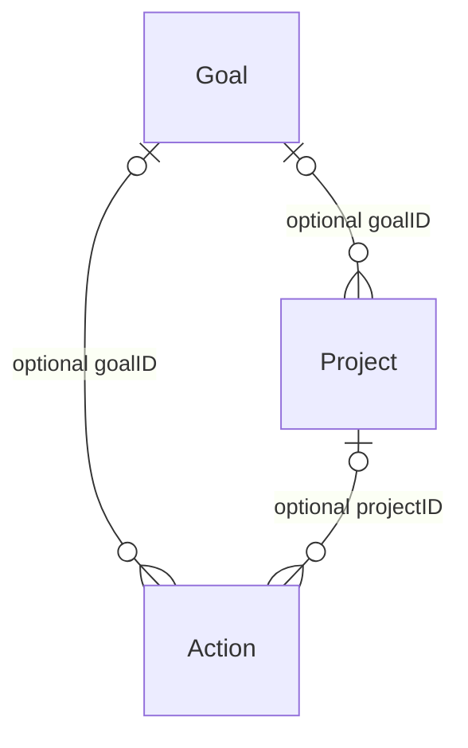

# TimeBite core domain model

TimeBiteCore is a standalone Swift package containing Foundation-only value types.
It establishes the Goal → Project → Action vocabulary for the production app;
it does not import any experimental repository architecture or build a UI.

## Models

- **Goal** describes a longer-term outcome, such as “Improve fitness”. It has an
  immutable UUID, title, optional notes and target date, lifecycle status, and
  creation/update timestamps.
- **Project** groups related actions, such as “Apple TestFlight”. It has the same
  common metadata, an optional goal ID, and optional start and target dates.
- **Action** is the central unit of execution: the thing a user plans or does.
  It has common metadata, optional goal and project IDs, planning timestamps and
  duration, actual timing, execution state, and action lifecycle status.
- **TimeBiteItem** shares identity, Codable, Equatable, Sendable, and common
  metadata requirements. It is a protocol, not a wrapper enum, persistence entity,
  or heterogeneous collection format. Encode concrete models.



Each parent can have zero or more children. Each child link can be absent.
Relationships are UUID references rather than nested objects or stored child
arrays. A repository can query children by their parent IDs without maintaining
multiple copies of a relationship.

## Progressive complexity

All three examples use exactly the same Action type:

```swift
import TimeBiteCore

// Simple: no hierarchy needed.
let workout = Action(title: "Leg workout")

// Medium: directly attach execution to an outcome.
let fitness = Goal(title: "Improve fitness")
let goalWorkout = Action(title: "Leg workout", goalID: fitness.id)

// Power: optionally group work into a project within a goal.
let beta = Goal(title: "Launch TimeBite Beta")
let testFlight = Project(title: "Apple TestFlight", goalID: beta.id)
let fixRings = Action(
    title: "Fix AM/PM ring rendering",
    goalID: beta.id,
    projectID: testFlight.id
)
```

Projects can also exist without goals. An action linked to a project does not
need to duplicate that project's goal ID. A future query layer can resolve its
effective goal through the project. If both IDs are supplied, they should agree
with the referenced project's goal. Count each action once in goal totals,
including when both direct and indirect links exist.

## State, identity, and editing

Goals and projects default to `ItemStatus.active`, with `completed` and
`cancelled` as the other states. Actions default to `ActionStatus.inbox`, with
`planned`, `active`, `completed`, and `cancelled` available. Execution state is
separate: `notStarted`, `running`, `paused`, or `completed`. For example, an
active action may have a paused timer.

Initializers require only a title. UUID and creation time default to new values;
update time defaults to that same creation time. IDs and creation timestamps are
immutable. Other properties are mutable for editing. Callers set `updatedAt`
when committing an edit; property assignments do not consult a hidden clock.
Explicit IDs and dates make imports and tests deterministic.

Synthesized equality compares all stored fields. Two revisions with the same
ID may be unequal; compare `.id` when checking entity identity. Value semantics
and Sendable allow the models to cross concurrency boundaries without shared
mutable object graphs.

## Validation contract

`Action.validationIssues(project:)` returns recoverable issues. It checks:

- Planned and actual durations must be finite and nonnegative. Zero is valid;
  nil means unknown and differs from zero.
- Actual end must not precede actual start when both exist.
- A supplied project must match the action's non-nil project ID.
- When the project matches and both goal IDs exist, those IDs must match.

Creation, assignment, and decoding preserve draft values; they do not throw for
these domain issues, clamp durations, or discard user input. Call validation
before committing or using an action in time aggregation, and present issues
for correction. Passing no project only validates local timing. Missing links
are allowed, including during editing/import. This helper does not fetch or
check existence of referenced records.

JSONEncoder rejects non-finite numbers by default. Validate before encoding;
finite negative imported durations can decode successfully and are then reported
by validation. Codable errors still apply to malformed field types, unknown enum
values, or missing required fields.

State transitions and completion requirements are deliberately not enforced in
v1. A completed action may have unknown timing (for example a manually checked-off
item). Changing execution state does not automatically change lifecycle status
or timestamps. A later execution service will own atomic transitions.

## Timing and future activity rings

Dates are absolute instants. Durations are `TimeInterval` seconds. Planning uses
`plannedStart` and `plannedDuration`. Execution uses `actualStart`, `actualEnd`,
and recorded `actualDuration`; the latter can exclude pauses and is never
silently derived from the two timestamps. Missing timing remains unknown.

Another layer can use these fields for a current (NOW) interval and split
continuous execution intervals at local noon and midnight for AM, PM, and daily
views. It can group actions by goal or project. Calendar, time zone, daylight
saving rules, overlap handling, and rendering belong to that layer.

One start/end pair plus active duration cannot locate pauses or multiple work
sessions precisely across AM/PM or day boundaries. Exact allocation of paused
or resumed work will require separate execution-session intervals later. V1
preserves the timing inputs without claiming that exact paused-time allocation
is already supported.

## Serialization and portability

Run `swift test` from the repository root using an Xcode toolchain that includes
XCTest. If Command Line Tools are selected, use a per-command override such as
`DEVELOPER_DIR=/Applications/Xcode-beta.app/Contents/Developer xcrun swift test`
(adjust the Xcode path to your installation).

`Package.swift` exports the
`TimeBiteCore` library from `TimeBiteCore/Models/`, with deployment floors of
macOS 12, iOS 15, watchOS 8, and visionOS 1. There are no third-party dependencies,
UI imports, or SwiftData annotations. Platform apps can depend on this package
and use `import TimeBiteCore`; persistence adapters can map these structs to
SwiftData, CloudKit, or backend records later.

Use an explicit JSON date strategy on both sides. Debug fixtures use UTC
ISO 8601 dates, sorted keys, fixed UUIDs, and whole-second timestamps:

```swift
let encoder = JSONEncoder()
encoder.dateEncodingStrategy = .iso8601
encoder.outputFormatting = [.prettyPrinted, .sortedKeys]
let data = try encoder.encode(workout)

let decoder = JSONDecoder()
decoder.dateDecodingStrategy = .iso8601
let restored = try decoder.decode(Action.self, from: data)
```

The standard ISO 8601 encoder strategy is suitable for these fixtures; a future
wire contract must explicitly choose fractional-second precision if needed.
Codable itself does not impose this date strategy. Optional nil fields are
omitted on encoding; both missing optional keys and explicit null decode to nil.
Required metadata and state fields must be present; initializer defaults are not
decoding defaults.

Fixtures are in `Tests/TimeBiteCoreTests/Fixtures/`:

| File | Scenario |
| --- | --- |
| `standalone-action.json` | Leg workout, no parents |
| `project-action.json` | Action referencing a project |
| `goal-action.json` | Action referencing a goal directly |
| `full-hierarchy.json` | Goal, project, action linked together |
| `completed-action.json` | Completed workout, one hour elapsed, 3,000 active seconds |

The full hierarchy's `goals`, `projects`, and `actions` arrays are a debugging
fixture envelope, not a production sync schema. The tests decode every fixture,
check links and timing, and verify Codable round trips. Tests also cover optional
fields, draft validation, identity, and equality.

## Deliberately deferred

Persistence adapters, migrations and wire-schema versioning; referential deletion
policies and sync conflict resolution; automatic timestamp/state transitions;
execution-session history and timer orchestration; recurrence; Gantt metadata;
AI logic; user classifications; and all production UI and ring rendering.
Existing boilerplate product documents predate this domain implementation and
have been preserved; this document describes the new core model.
